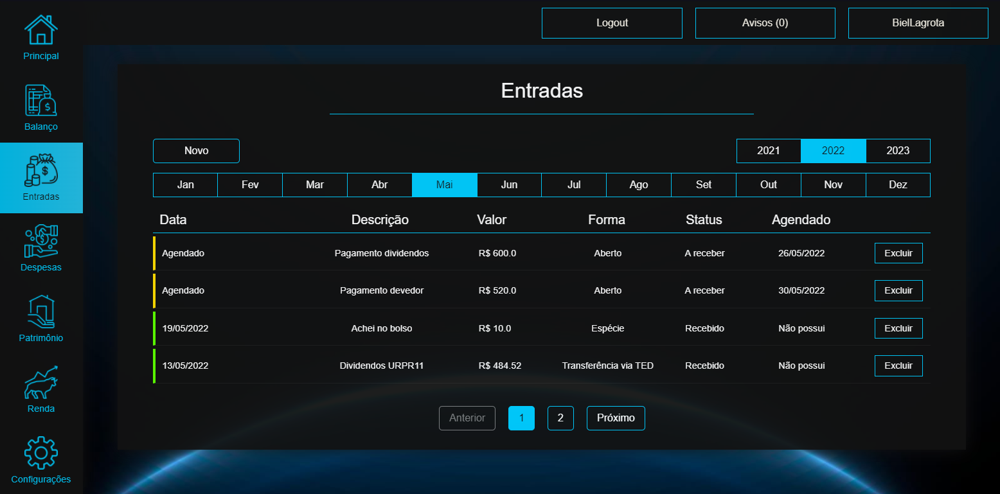
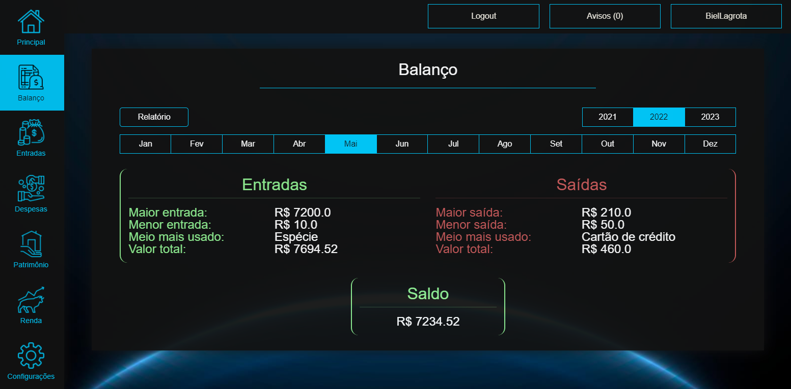

# iFinance MVP

## Tópicos

- [Descrição do projeto](#descrição-do-projeto)
- [Funcionalidades](#funcionalidades)
- [Aplicação](#aplicação)
- [Tecnologias utilizadas](#tecnologias-utilizadas)
- [Acesso ao projeto](#acesso-ao-projeto)
- [Abrir e rodar o projeto](#abrir-e-rodar-o-projeto)
- [Desenvolvedor](#desenvolvedor)
- [UML](#uml)

## Descrição do projeto
O iFinance tem como objetivo proporcionar aos usuários o controle de suas finanças de forma extremamente simples e intuitiva.

## Funcionalidades

:heavy_check_mark: `Controle de entrada e saída:` No iFinance é possível cadastrar entrada e saída de capital, sendo possível inclusive realizar agendamentos para pagamentos de despesas e recebimentos. Os atrasos e entradas/saídas para o dia atual são destacados, proporcionando maior controle sobre o pagamento e recebimento de valores.

:heavy_check_mark: `Balanço de entradas e saídas:` Disponibilizamos uma aba do sistema para que seja acessado o balanço do mês que você deseja verificar. Sendo disponibilizadas também algumas informações úteis daquele mês, como por exemplo, o meio de pagamento mais utilizado para entradas e saídas. Sendo possível também gerar um relatório em PDF referente ao balanço do mês correspondente.

:heavy_check_mark: `Resumo de informações relevantes:` Nossa home page é composta de informações úteis e diretas para que você consiga organizar melhor suas finanças. Como por exemplo: Contas atrasadas, Contas a receber, e etc.

:heavy_check_mark: `Login com criptografia de senha:` Ao se cadastrar no iFinance, sua senha é criptografada e é enviada junto com seus dados direto para um banco de dados em nuvem. 

:heavy_check_mark: `Registro e controle de patrimônio:` É possível também cadastrar seus patrimônios, e filtra-los por categoria. Por exemplo: Veículos, investimentos, etc.

:heavy_check_mark: `Cadastro de rentabilidade:` Você também pode cadastrar suas rendas e definir a periodicidade de cada uma delas. É possível cadastrar salários, dividendos, renda extra e outros.

## Aplicação

`Tela de entradas`


`Tela de balanço`


## Tecnologias utilizadas

- Java 8
- Html
- Css
- JavaScript
- MySql
- JPA
- Thymeleaf
- Spring MVC
- Lombok
- Spring boot security
- J Unit
- Open Pdf
- Bootstrap

## Acesso ao projeto
O projeto está disponibilizado para utilização gratuita e ilimitada na url
https://ifinancebr.herokuapp.com

## Abrir e rodar o projeto
1. Para rodar o projeto basta utilizar o git clone com a url https://github.com/LagrotaGabriel/iFinance.git
2. Em seguida, recomenda-se que configure o arquivo `application.properties` com o código abaixo para configuração da persistência do projeto
   ```java 
   server.port = 8080
   spring.mvc.pathmatch.matching-strategy=ant-path-matcher
   spring.datasource.url=jdbc:mysql://localhost:3306/db?useTimezone=true&serverTimezone=UTC
   spring.datasource.username=root
   spring.datasource.password=123456
   spring.jpa.hibernate.ddl-auto=update
   spring.jpa.show-sql=true
   spring.jpa.properties.hibernate.dialect=org.hibernate.dialect.MySQL5InnoDBDialect
3. Após configurar o `application.properties`, sugiro que você crie um schema no mysql com o nome db
4. Execute o código e acesse o projeto rodando em servidor local pela url http://www.localhost:8080

## Desenvolvedor
[<br><sub>Gabriel Lagrota</sub>](https://github.com/LagrotaGabriel)

# UML


