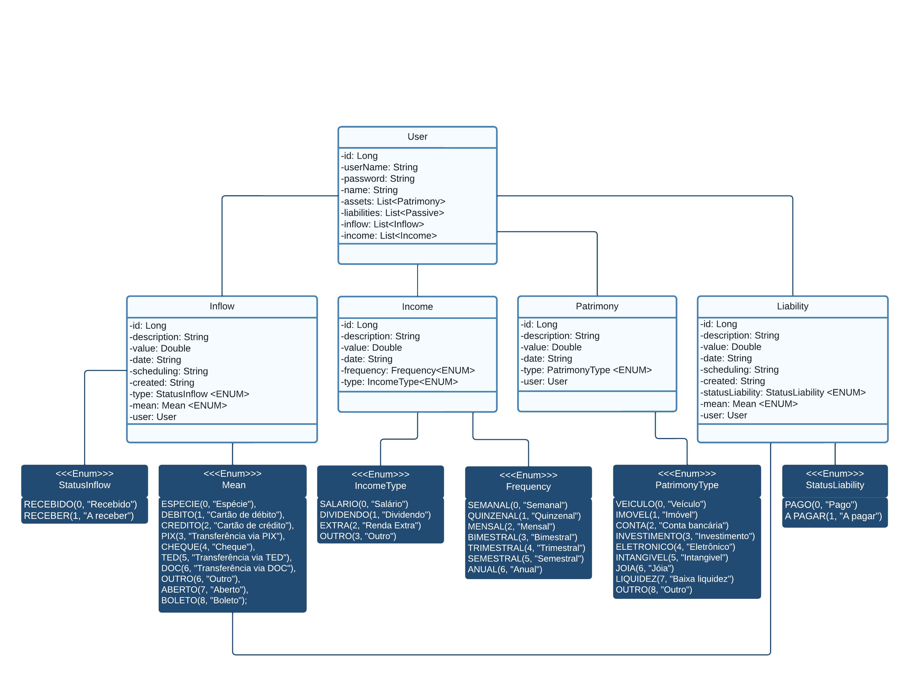

# iFinance - Em construção

## [PT] Projeto
Web app com API que objetiva proporcionar ao usuário a gestão de suas finanças pessoais, como:

- Controle de ativos;
- Controle de passivos;
- Controle de despesas (Mensais/Anuais);
- Divisão de despesas por categoria, com percentual de capital alocado em determinado período de tempo;
- Simulações de investimentos.

## [EN] Project

Web app with API that aims to provide the user the management of their personal finances, such as:

- Asset control;
- Liabilities control;
- Expenses control (Monthly/annual);
- Division of expenses by category, with percentage of capital allocated in a given period of time;
- Investment simulations.

# UML

